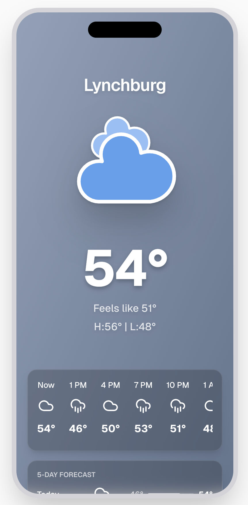
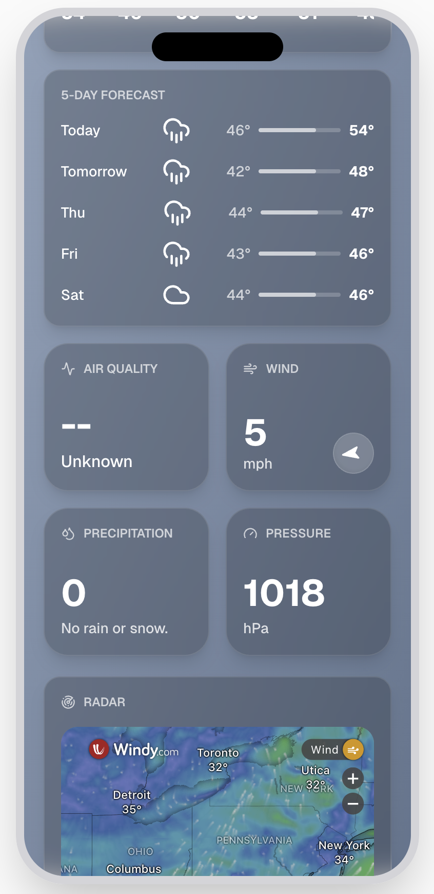

# Weather Application - CSCN 408 Assignment 3

A modern, responsive weather application built with Next.js 16, featuring real-time weather data, forecasts, air quality monitoring, and interactive weather radar for Lynchburg, Virginia.



## Table of Contents

1. [Overview](#overview)
2. [Features](#features)
3. [Technical Stack](#technical-stack)
4. [Prerequisites](#prerequisites)
5. [Installation & Setup Guide](#installation--setup-guide)
6. [Running the Application](#running-the-application)
7. [Project Structure](#project-structure)
8. [API Integration](#api-integration)
9. [Design Features](#design-features)
10. [About Next.js](#about-nextjs)

---

## Overview

This weather application provides comprehensive weather information in a mobile-first, iPhone-inspired interface. The application fetches real-time data from multiple weather APIs and presents it in an intuitive, visually appealing format that adapts to current weather conditions.

The application displays:
- Current temperature and weather conditions
- "Feels like" temperature
- Daily high and low temperatures
- 8-hour hourly forecast
- 5-day extended forecast
- Air quality index
- Wind speed and direction
- Precipitation (rain/snow) amounts
- Atmospheric pressure
- Interactive weather radar
- Government weather alerts (when active)



---

## Features

### 🌤️ **Real-Time Weather Data**
- Current temperature, conditions, and "feels like" temperature
- Automatic updates every 10 minutes (600-second cache)
- Dynamic weather icons that change based on conditions and time of day (day/night)
- Gradient backgrounds that adapt to weather conditions and time

### 📅 **Forecasting**
- **Hourly Forecast**: 8-hour detailed forecast with temperature and conditions
- **Daily Forecast**: 5-day forecast with high/low temperatures and weather conditions
- Intelligent condition prioritization (severe weather takes precedence)

### 🌬️ **Environmental Monitoring**
- **Air Quality Index (AQI)**: Real-time air quality status
- **Wind Data**: Speed and direction with rotating compass arrow
- **Precipitation**: Rain and snow measurement in mm
- **Atmospheric Pressure**: Current pressure in hPa

### 🗺️ **Interactive Radar**
- Embedded Windy.com radar map
- Real-time weather patterns visualization
- Zoomable and interactive

### ⚠️ **Weather Alerts**
- Integration with National Weather Service alerts
- Displays active weather warnings for Lynchburg, VA area
- Prominent visual alerts when severe weather is detected

### 🎨 **Modern UI/UX**
- iPhone-style design with dynamic island
- Glassmorphism effects (frosted glass appearance)
- Responsive animations and smooth scrolling
- Adaptive color schemes based on weather conditions
- Night mode detection (darker gradients for nighttime)

### 🔄 **Robust Error Handling**
- Fallback to local JSON data if APIs are unavailable
- Graceful degradation of features
- Server-side rendering for optimal performance

---

## Technical Stack

This project is built with modern web technologies:

- **[Next.js 16.1.6](https://nextjs.org/)** - React-based web framework with server-side rendering
- **[React 19.2.3](https://react.dev/)** - UI component library
- **[TypeScript 5](https://www.typescriptlang.org/)** - Type-safe JavaScript
- **[Tailwind CSS 4](https://tailwindcss.com/)** - Utility-first CSS framework
- **[Lucide React](https://lucide.dev/)** - Icon library for weather symbols
- **[ESLint](https://eslint.org/)** - Code quality and consistency

### APIs Used:
1. **Weather API (via RapidAPI)** - Forecast and current weather data
2. **National Weather Service API** - Government weather alerts
3. **Windy.com** - Embedded radar visualization

---

## Prerequisites

Before running this application, ensure you have the following installed on your system:

### Required Software:

1. **Node.js** (version 20 or higher)
   - Download from: [https://nodejs.org/](https://nodejs.org/)
   - Node.js is a JavaScript runtime that allows you to run JavaScript code outside of a web browser
   - The installer includes **npm** (Node Package Manager), which is used to install project dependencies

2. **A Code Editor** (recommended: Visual Studio Code)
   - Download from: [https://code.visualstudio.com/](https://code.visualstudio.com/)

3. **A Modern Web Browser** (Chrome, Firefox, Safari, or Edge)

### Required API Key:

You will need a **RapidAPI key** to access the weather data:

1. Go to [https://rapidapi.com/](https://rapidapi.com/)
2. Sign up for a free account
3. Subscribe to the "Weather API" service (there's a free tier)
4. Copy your API key

---

## Installation & Setup Guide

### New to Next.js:

**What is Next.js?**
Next.js is a React framework that makes it easy to build web applications. Unlike traditional React apps that run entirely in the browser (client-side), Next.js can render pages on the server before sending them to the browser. This results in:
- Faster initial page loads
- Better search engine optimization (SEO)
- Simplified routing and navigation
- Built-in optimization features

Think of it as an enhanced version of React with additional features for building production-ready web applications.

---

### Step-by-Step Setup:

#### 1. Extract/Clone the Project

If you received this as a ZIP file:
```bash
# Extract the ZIP file to your desired location
# Navigate to the project folder in Terminal (Mac) or Command Prompt (Windows)
cd path/to/weather-app
```

#### 2. Install Dependencies

The project requires several external libraries (listed in `package.json`). To install them:

```bash
npm install
```

**What this does:** 
- Reads the `package.json` file
- Downloads all required packages from the npm registry
- Creates a `node_modules` folder containing all dependencies
- This may take 1-2 minutes depending on your internet connection

#### 3. Set Up Environment Variables

Next.js uses environment variables to store sensitive information like API keys. These should NEVER be committed to version control.

Create a file named `.env.local` in the root of the project:

```bash
# Create the file
touch .env.local
```

Open `.env.local` in a text editor and add your RapidAPI key:

```
RAPIDAPI_KEY=your_actual_api_key_here
```

Replace `your_actual_api_key_here` with the API key you obtained from RapidAPI.

**Important:** 
- The `.env.local` file is automatically ignored by Git (listed in `.gitignore`)
- Never share your API key publicly
- Environment variables prefixed with `NEXT_PUBLIC_` are exposed to the browser; others remain server-side only

#### 4. Verify Installation

Check that everything is installed correctly:

```bash
# Check Node.js version
node --version

# Check npm version
npm --version

# List installed dependencies (optional)
npm list --depth=0
```

---

## Running the Application

### Development Mode

To run the application in development mode (with hot-reloading):

```bash
npm run dev
```

**What this does:**
- Starts the Next.js development server
- Enables Fast Refresh (automatic page updates when you edit code)
- Provides detailed error messages in the browser
- Runs on `http://localhost:3000` by default

You should see output similar to:
```
   ▲ Next.js 16.1.6
   - Local:        http://localhost:3000
   - Environments: .env.local

 ✓ Starting...
 ✓ Ready in 2.3s
```

Open your browser and navigate to **[http://localhost:3000](http://localhost:3000)**

The page will automatically reload if you make changes to the code.

### Production Build

To build the application for production:

```bash
# Build the optimized production bundle
npm run build
```

**What this does:**
- Compiles and optimizes all code
- Generates static HTML files where possible
- Minifies JavaScript and CSS
- Creates an optimized build in the `.next` folder
- Typically takes 30-60 seconds

After building, run the production server:

```bash
npm run start
```

This runs the optimized version of your application (faster and more efficient).

### Other Commands

```bash
# Run the linter to check code quality
npm run lint
```

---

## Project Structure

Understanding the file organization:

```
weather-app/
├── app/                          # Next.js App Router directory
│   ├── page.tsx                  # Main weather page (homepage)
│   ├── layout.tsx                # Root layout (wraps all pages)
│   ├── globals.css               # Global styles
│   └── test/                     # Test page directory
│       └── page.tsx              # Test page component
│
├── public/                       # Static assets (accessible via URL)
│   ├── current-example.json      # Fallback data for current weather
│   ├── forecast-example.json     # Fallback data for forecast
│   ├── readme/                   # Documentation images
│   │   ├── demo-main.png
│   │   └── demo-forecast.png
│   └── *.svg                     # Weather condition SVG icons
│
├── node_modules/                 # Installed dependencies (auto-generated)
│
├── .next/                        # Build output (auto-generated)
│
├── package.json                  # Project metadata and dependencies
├── package-lock.json             # Locked dependency versions
├── next.config.ts                # Next.js configuration
├── tsconfig.json                 # TypeScript configuration
├── tailwind.config.ts            # Tailwind CSS configuration
├── postcss.config.mjs            # PostCSS configuration
├── eslint.config.mjs             # ESLint configuration
├── .env.local                    # Environment variables (YOU CREATE THIS)
├── .gitignore                    # Files to exclude from Git
└── README.md                     # This file
```

### Key Files Explained:

- **`app/page.tsx`**: The main application code. Contains all the weather data fetching, processing, and rendering logic.
- **`app/layout.tsx`**: Defines the HTML structure and metadata that wraps all pages.
- **`package.json`**: Lists all dependencies and scripts for the project.
- **`.env.local`**: Stores secret API keys (you must create this file).
- **`public/`**: Any file in here can be accessed directly via the URL (e.g., `/day.svg`).

---

## API Integration

### 1. Weather Forecast API (RapidAPI)

**Endpoint:** `https://weather-api167.p.rapidapi.com/api/weather/forecast`

**Purpose:** Provides hourly and daily forecast data

**Parameters:**
- `place`: Lynchburg,VA,US
- `units`: imperial (Fahrenheit)

**Data Retrieved:**
- Temperature (current, feels-like, min, max)
- Weather conditions (clear, clouds, rain, snow, etc.)
- Humidity
- Pressure
- Wind speed and direction
- Precipitation amounts
- Part of day (day/night)

### 2. Current Weather API (RapidAPI)

**Endpoint:** `https://weather-api167.p.rapidapi.com/api/weather/current`

**Purpose:** Provides air quality index data

**Data Retrieved:**
- Air Quality Index (AQI)
- Air Quality Status

### 3. National Weather Service Alerts API

**Endpoint:** `https://api.weather.gov/alerts/active`

**Purpose:** Government-issued weather alerts

**Parameters:**
- `point`: 37.4138,-79.1422 (Lynchburg coordinates)

**Data Retrieved:**
- Active weather alerts
- Alert type and severity
- Alert headlines and descriptions

### 4. Windy.com Embedded Radar

**Embedded iframe displaying:**
- Real-time weather radar
- Wind patterns
- Interactive map

### Caching Strategy

The application uses Next.js's built-in caching with a 600-second (10-minute) revalidation period:

```typescript
next: { revalidate: 600 }
```

This means:
- Data is fetched server-side
- Results are cached for 10 minutes
- Subsequent requests within 10 minutes use cached data
- After 10 minutes, the next request triggers a fresh fetch

### Fallback Mechanism

If API requests fail, the application uses local JSON files:
- `public/current-example.json`
- `public/forecast-example.json`

This ensures the application remains functional even if the APIs are down or rate limits are exceeded.

---

## Design Features

### Dynamic Weather Icons

The application uses the Lucide React icon library with intelligent icon selection:

```typescript
function getHourlyIcon(condition: string, partOfDay: string)
```

Icons change based on:
- Weather condition (clear, clouds, rain, snow, fog, thunderstorm)
- Time of day (sun for daytime, moon for nighttime)

### Adaptive Color Gradients

Background gradients dynamically change based on weather and time:

```typescript
function getWeatherGradient(condition: string, partOfDay: string)
```

Examples:
- Clear day: Sky blue gradient
- Clear night: Deep indigo/purple gradient
- Rainy: Dark slate gradient
- Snowy: Light blue gradient

### SVG Weather Illustrations

Custom SVG files provide beautiful weather visualizations:
- `day.svg` - Sunny weather
- `night.svg` - Clear night
- `cloudy.svg` - Cloudy day
- `cloudy-night-1.svg` - Cloudy night
- `rainy-1.svg` - Rain
- `rainy-6.svg` - Thunderstorms
- `snowy-1.svg` - Snow

### Glassmorphism Design

The UI uses modern glassmorphism effects:
```css
bg-black/20 backdrop-blur-md
```

This creates a frosted glass appearance over the gradient background.

### Responsive Layout

The application is designed to mimic an iPhone interface:
- Fixed width: 393px (iPhone 15 Pro width)
- Fixed height: 852px
- Rounded corners: 3rem
- Border: 8px (simulating device bezel)
- Fake dynamic island at the top

### Intelligent Forecasting

Daily forecast intelligently selects conditions:
- Prioritizes severe weather (thunderstorms > snow > rain > clouds > clear)
- Calculates actual daily high/low from all hourly data points
- Displays most representative condition for each day

---

## About Next.js

### Why Next.js?

Next.js is chosen for this project because it provides:

1. **Server-Side Rendering (SSR)**: Weather data is fetched on the server before sending HTML to the browser, resulting in faster initial loads and better SEO.

2. **API Route Protection**: API keys are kept secure on the server and never exposed to the browser.

3. **Automatic Code Splitting**: Only the necessary JavaScript is loaded for each page.

4. **Built-in Optimization**: Automatic image optimization, font optimization, and code minification.

5. **File-based Routing**: The folder structure in `app/` automatically creates routes (e.g., `app/page.tsx` → `/`, `app/test/page.tsx` → `/test`).

### Key Next.js Concepts Used:

#### App Router (Next.js 13+)
This project uses the modern App Router instead of the legacy Pages Router:
- Files in `app/` directory define routes
- `page.tsx` files define route components
- `layout.tsx` files define shared layouts
- Server Components by default (better performance)

#### Server Components
The main weather page (`app/page.tsx`) is a Server Component:
```typescript
export default async function Home() {
  // This code runs on the server
  const response = await fetch(apiUrl);
  // ...
}
```

Benefits:
- API calls happen on the server (secure)
- Reduced JavaScript sent to browser
- Direct access to backend resources

#### Data Fetching with Caching
```typescript
fetch(url, {
  next: { revalidate: 600 }
})
```

This uses Next.js's extended `fetch` API with automatic caching and revalidation.

#### Environment Variables
Next.js automatically loads `.env.local` files and makes variables available via `process.env`:
```typescript
process.env.RAPIDAPI_KEY
```

Variables NOT prefixed with `NEXT_PUBLIC_` are only available on the server side.

### Learning Resources

For professors wanting to learn more about Next.js:
- Official Tutorial: [https://nextjs.org/learn](https://nextjs.org/learn)
- Documentation: [https://nextjs.org/docs](https://nextjs.org/docs)
- React Foundations: [https://nextjs.org/learn/react-foundations](https://nextjs.org/learn/react-foundations)

---

## Troubleshooting

### Common Issues:

**"Module not found" errors:**
```bash
# Delete node_modules and reinstall
rm -rf node_modules package-lock.json
npm install
```

**Port 3000 already in use:**
```bash
# Use a different port
PORT=3001 npm run dev
```

**API errors:**
- Check that `.env.local` exists and contains your API key
- Verify your RapidAPI subscription is active
- Check API usage limits on RapidAPI dashboard

**Build errors:**
```bash
# Clear Next.js cache
rm -rf .next
npm run build
```

---

## Credits

- **Weather Icons**: Lucide React icon library
- **Weather Illustrations**: Custom SVG assets
- **Weather Data**: Weather API via RapidAPI
- **Alerts**: National Weather Service API
- **Radar**: Windy.com embedded widget
- **Fonts**: Geist Sans and Geist Mono (Vercel)

---

## License

This project was created for educational purposes as part of CSCN 408 coursework.

---

**Developed by:** Jeffrey Van Dever  
**Course:** CSCN 408  
**Assignment:** Assignment 3 - Weather Application  
**Date:** March 2026